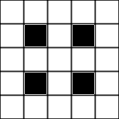

# Updated POMDP Model

## Overview

This model contains helper robots and random agents. Random agents are agents that are dependent on others for help, such as elderly people or toddlers. Helper robots seek to maximise the amount of help they provide to random agents according to a certain ethical framework.

### State, Actions and Observations

A state for this problem comprises the Cartesian coordinates of each helper robot and each random agent, as well the condition of each random agent. The coordinates of each robot and agent are always known with 100% certainty. The condition of each random agent is partially observed.

An action for this problem is a pair of Cartesian coordinates, taken from all valid coordinates for the problem (that is, coordinates that are on a grid and do not contain a wall). Sending an action to a helper robot indicates that that robot should move towards those coordinates and help any random agent at those coordinates. It also signals to any random agent at those coordinates to wait and receive help.

An observation for this problem comprises the believed condition of each random agent. As mentioned before, conditions are partially observable.

## GAMA

### Grid

The grid in this model is of width 5 and height 5. Its layout is as follows:



where white cells represent the floor and black cells represent walls.

Each cell in the grid has four neighbours, as defined by a [Von Neumann neighbourhood](https://www.google.com/url?sa=t&rct=j&q=&esrc=s&source=web&cd=&cad=rja&uact=8&ved=2ahUKEwj8lcPihPf1AhUYTWwGHUj2B5AQFnoECAIQAQ&url=https%3A%2F%2Fen.wikipedia.org%2Fwiki%2FVon_Neumann_neighborhood&usg=AOvVaw2OMcpbgZ8joUN54Az165bN).

GAMA also keeps track of which helper robots and which random agents are in a given cell, for easy access to this data. These data can be accessed by the fields `robots_in_cell` and `dependents_in_cell` in the `grid_cell` species.

### Simulation Model

The simulator interacts with the OPPT solver by sending and receiving information related to the execution of the model. There are three pipes used to do this: these are `pipeToGama` (used by GAMA to receive information from the solver), `statePipeToSolver` (used by GAMA to send information relating to state to the solver) and `observationPipeToSolver` (used by GAMA to send information relating to observations to the solver).

When the simulation starts, it also sends some information to the solver needed to run the simulation using a series of files. These files encode information about the problem’s grid and the details and condition change matrices for each random agent.

Note that GAMA represents matrices in $$(x,y)$$ form as opposed to row-column form. An example is shown below, with the GAMA matrix representation shown on the left and the traditional matrix representation shown on the right.

```
[0.9, 0.0, 0.0, 0.5]
[0.1, 0.8, 0.0, 0.0]                    [0.0, 0.1, 1.0, 0.5]                   [0.0, 0.1, 0.0, 0.0]
```

$${\begin{bmatrix} 0.9 & 0.1 & 0.0 & 0.0\\ 0.0 & 0.8 & 0.1 & 0.1\\ 0.0 & 0.0 & 1.0 & 0.0\\ 0.5 & 0.0 & 0.5 & 0.0\\ \end{bmatrix}}$$

GAMA also takes data from the solver’s configuration file, namely the initial state of the problem, so that it can initialise the locations and conditions of each helper robot and random agent.

### Random Agents

Random agents are dependent on helper robots for help. Each random agent has a location, as well as a current condition. At present, there are four conditions in the problem. These are:

- `0` - “happy”
- `1` - “agitated”
- `2` - “sad”
- `3` - “angry”

Random agents move between these conditions stochastically. If a random agent is happy, it will move one cell on the grid with a 50% chance. If a random agent shares a cell with a helper robot, its condition becomes `0` with 100% certainty.

Each random agent has a type and an ID. A random agent’s type determines what transition matrix it subscribes to with regards to changing conditions. At the moment, the two random agent types (elderly and toddler) have the same condition transition matrices, but this is subject to change. No two random agents can share the same type and ID.

### Helper Robots

Helper robots serve to help random agents according to a certain ethical framework. This is defined in the OPPT solver. In the GAMA simulation, their state contains their location, their current action (as well as how to complete it), the location of each random agent in the problem, and their belief of the condition of each random agent in the problem.

While the method in which helper robots observe random agent conditions is still to be defined, it has previously been defined by a combination of probability and “sight”. One agent “seeing” another is defined by the existence of a line `y = mx + c` existing between the two agents that does not cross a wall in the problem grid. If a helper robot can “see” a random agent, then it has a 0.8 probability of observing its condition.

If a helper robot has no action to complete, it will request a new action from the solver. This is done by listening to the named pipe `pipeToGama`. If it has made any observations while executing the previous action, it will send these prior to waiting for a new action. Once the helper robot has received an action, it will inform any random agents residing at that location to stay where they are while it comes to them for help.

If a helper robot has an action to complete, it will continue to follow a pre-set path towards the location encoded in this action.

If a helper robot happens to share the same cell as a random agent, it will immediately help that agent. This results in the random agent’s condition being `0` (happy) and the helper robot observing this new condition with 100% probability.

## OPPT Solver

### Solver

At present, the solver for this problem uses the default ABT solver.

### Initial State

The initial state (and therefore, initial belief) is instantiated by the user via the GAMA experiment GUI.

### Transition Plugin

There are two transition plugins: one where OPPT runs its own internal model for planning, and another where it communicates with GAMA for execution. The model in both of these plugins is the same.

The transition plugin takes a state $$S$$ and an action $$A$$ as input. As mentioned before, $$A$$ is a Cartesian coordinate $$(x,y)$$. The helper robot must move towards this location on the grid as its action. If there are any random agents at $$(x,y)$$, they immediately stop and cannot change condition until the helper robot arrives at their location. Once the helper robot has arrived at their location, their condition becomes 0 (happy). This behaviour applies in general: if a helper robot shares a cell with a random agent, the random agent’s condition instantly becomes 0.

Executing an action as defined in this model takes up several “cycles” (individual timesteps) in GAMA. That is, while the helper robot is busy moving towards its destination, the other agents in the problem will also be doing certain actions. Each random agent follows a certain stochastic condition transition matrix depending on its type (examples include elderly, baby etc.). If a random agent’s condition is 0 (happy), there is also a 50% chance that it moves one space on the board in a random direction (unless it would move into a wall in that direction, in which case it doesn’t move).

### Observation Plugin

Like the transition plugins in this model, there are two observation plugins: one where OPPT runs its own internal model for planning, and another where it communicates with GAMA for execution. Again, the model in both of these plugins is the same.

Given a state $$S$$ and an action $$A$$, the observation plugin will return a list of condition observations $$c$$, where observation $$c_i$$ corresponds to the observed condition of the $$i$$-th random agent $$R_i$$. As mentioned in the transition plugin, whenever a helper robot shares a cell with a random agent, the random agent’s condition instantly becomes 0. The helper robot is guaranteed to observe this agent’s new condition when this happens.

Apart from this, helper robots have a `0.8` probability of observing a random agent’s condition at each timestep in GAMA, for each random agent.

If no helper robot observes $$c_i$$ for random agent $$R_i$$ during the execution of $$A$$, then this value is the same value as $$c_i$$ in $$S$$.

### Reward Plugin

The reward plugin maximally rewards the solver if all random agents have condition `0`, that is, if all random agents in the problem are happy. If there are unhappy random agents (ones that do not have condition `0`), then the solver is penalised depending on how many random agents are unhappy and how far the robot is away from these unhappy agents.

## Running the Simulation

Because there is so much data being sent between GAMA and OPPT, it is important to follow these steps precisely.
1. In the [GAMA IDE](https://gama-platform.org/download), import the directory `HMIGamaInterface`.
2. Press the green play button at the top of the GAMA window. This will take you to the grid. You should see two categories on the left of the screen: `Robots` and `Random Agents`.
3. If you wish to change the existing random agent settings, you may do so. In the category `Number of Random Agents`, you will see a map of random agent types corresponding to how many of them will be in the simulation. You can edit this map and, provided you add images and define a transition matrix, create new types as well. Make sure that the number of locations and conditions for each type in `Random Agent Locations` and `Random Agent Conditions` respectively match how many random agents are in the simulation as defined by `Number of Random Agents`. Note that the `Robot` parameters have not been extensively tested, and so are not guaranteed to work just yet.
4. When you are satisfied with the parameters you have set, press the green play button again. Sometimes the agents in the problem do not appear straight away. If this happens, double click on the simulation, and they should appear. Some of the random agents may not be in the location specified initially. This is because random agents move in GAMA before the robot does. The program should be hanging at this point.
5. Now, open a terminal and navigate to `oppt_hmi_scripts`. When you have arrived there, run the `execute.sh` script using the command `./execute.sh`. The model should now be running.
