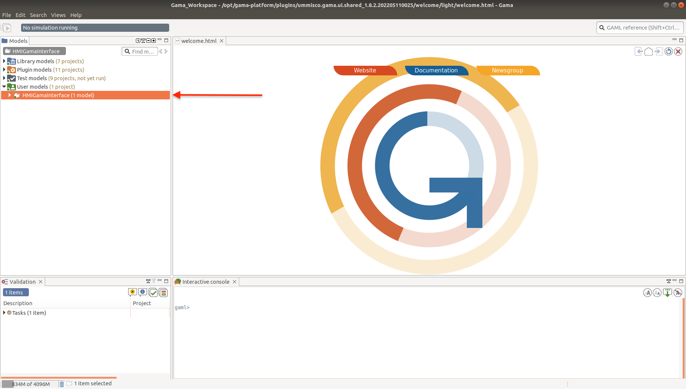

# Towards Incorporating Empathy into Automated Decision-Making

## Overview

This repository contains a simulation framework for visualising and experimenting with POMDP solvers.
It also contains an instance of the On-line POMDP Planning Toolkit (OPPT), whose base repository can be found [here](https://github.com/RDLLab/oppt).

## Installation

### Basic setup

If you haven't already, you will need to download the [GAMA IDE](https://gama-platform.org/download).
After cloning this repository, you will first want to unzip the file `oppt_install.zip`.
Then, you will want to open a Terminal window and the GAMA IDE.

### Setting up GAMA

When opening the GAMA IDE, you will be prompted to choose a Workspace.
The default Workspace provided by GAMA will work fine.
You may then be asked if you would like to create a new Workspace, if the default Workspace does not exist.
You can click "Yes" here and proceed.

After doing the above steps, you should have a GAMA window similar to this:


In the left-hand side column of this window, you will see several directories corresponding to different types of models.
Right click on "User models".
You will then see a drop-down menu.
Hover over the "Import..." button, and you will see more options appear.
Among these options, click "GAMA Project...".

A pop-up window will then appear, titled *Import GAMA projects*, asking you which GAMA project you would like to import.
Click on the "Browse..." button directly to the right of the "Select root directory:" option, as displayed here:


A pop-up window of your filesystem will now open.
You should navigate towards the location where you cloned this project, and then select the `HMIGamaInterface` directory to import.
Once you have selected this directory, you should return to the previous pop-up window, titled *Import GAMA projects*.
You should see an entry inside the box titled "Projects".
If you see this, you can now click the "Finish" button at the bottom of the pop-up window.
If you do not see this, we suggest you repeat the above steps again.

You should now have an entry under "User models" as such:



### Setting up the Terminal environment

To run OPPT, we need to add some commands into the `.bashrc` file.
In Unix systems, the `.bashrc` file is normally found in your home directory, also marked as `~`.
Running `cd ~` and then editing `.bashrc` with your preferred text editor (for example, `nano .bashrc`) should open this file in an editable mode.

You will then want to add the following commands to your `.bashrc` file:

```
source /opt/ros/melodic/setup.sh
export oppt_DIR=<path_to_this_directory>/oppt_install/lib/cmake/oppt
source <path_to_this_directory>/oppt_install/share/oppt/setup.sh
```

Because OPPT is plugin-based, it is necessary to use a file system API to obtain necessary resources, such as files, plugins, etc.

Once you have added these commands to your `.bashrc` file, you will want to close and restart the Terminal, so that these commands are run in your Bash environment.
Then, `cd` so that you are at the root directory of this repository (that is, the directory that contains this README).
Then, `cd` into the `oppt_hmi_scripts` directory. Run the following command:

```
./build.sh
```

This will build OPPT so that it is ready to run.
This will take some time, so feel free to make yourself a cup of tea in the meantime.

### Running the simulation

Before we run OPPT, we need to provide it with data.
This data is obtained from the simulation environment, after we have made any modifications to it.
So, we first need to run the simulation environment in GAMA to provide OPPT with the necessary data to run.

To run the simulation environment in GAMA, on the left-hand side column titled "Models", open up "User models", then inside "User models" open the directory "HMIGamaInterface", then inside "HMIGamaInterface" open the directory "models".
Inside the "models" directory you should find the file `HMIGamaInterface.gaml`.
Open this file (possibly by double clicking on it).
You should have a GAMA window looking like this:


Near the top of the GAMA window, you should see a green button with a play sign and the text "out".
Click this button to start the simulation.

The simulation will start off paused.
This is to provide you with time to modify the parameters of the model, which you can find on the left-hand side column of the window.


There are three sections of parameters: "Robot", "Requesters" and "Hyperparameters".
Feel free to experiment with the pre-defined values of these parameters.
Note however, a few things:
1. Locations of agents are represented by GAML's [`point` type](https://gama-platform.org/wiki/DataTypes#point). This data type represents a 3D point, and is encased by curly braces `{}`. Since our problem is two-dimensional, we are only interested in the first two elements of each point.
2. Information about requesters are stored in GAML's [`map` type](https://gama-platform.org/wiki/DataTypes#map). This is represented as a [list](https://gama-platform.org/wiki/DataTypes#list) (enclosed by square brackets `[]`) of instances the [`pair` type](https://gama-platform.org/wiki/DataTypes#pair). A pair is defined as two elements connected by two colons, that is `<element1>::<element2>` makes up a pair.
3. The location of each requester is represented of a map of requester types to lists of points, with each point corresponding to one requester of that type. Make sure that the number of random agents of each type and their locations match.

Once you are ready, press the green play button again. You may need to double-click to see all the sprites; this is a bug in the implementation of GAMA.
Then, press the green play button again to start the simulation.

You will notice that the simulation does not run when you first start it. This is because it is waiting for the solver (inside OPPT) to provide it with an action.
We now return to our open Terminal, `cd` to the `oppt_hmi_scripts` folder within this repository, and run

```
./execute.sh
```

The simulator should now be running.